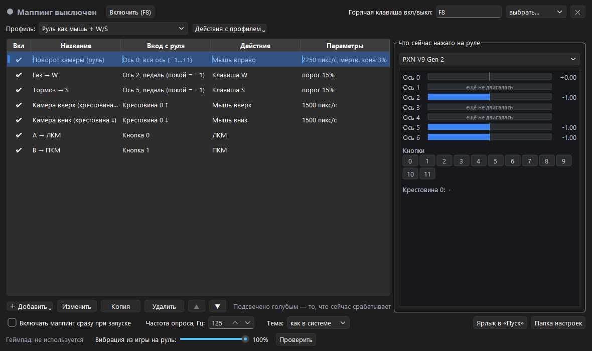
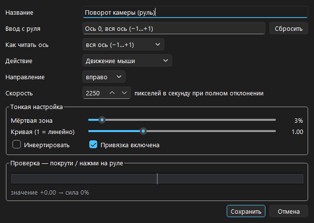

<div align="center">

# WheelScript

**Turns a racing wheel into a mouse and a keyboard - or into a virtual Xbox gamepad. For games that do not understand a wheel: steering moves the camera, pedals press keys, buttons and the shifter do whatever you map them to.**

[Download for Windows](https://github.com/ALEXalesha/WheelScript/releases/latest) &nbsp;·&nbsp; [Русская версия этого файла](README.ru.md)

[](https://github.com/ALEXalesha/WheelScript/actions/workflows/ci.yml)
[](https://github.com/ALEXalesha/WheelScript/releases/latest)
[](LICENSE)



</div>

> **The interface is in Russian**, and so is the full manual - [README.ru.md](README.ru.md), which this file summarises. In the screenshot, "Ввод с руля" is the wheel input, "Действие" the action it performs, and "Что сейчас нажато на руле" is the live monitor of axes, buttons and the hat.

## What it is

A mapper: wheel, pedals, buttons and shifter in, mouse / keyboard / virtual Xbox gamepad out. Mapping is done in the window - click the **wheel input** field, then turn the wheel or press the pedal, and the program recognises it by itself.

Tested on a **PXN V9 Gen 2** (with the shifter); it works with any wheel, joystick or gamepad Windows sees as a game device.

| | |
| --- | --- |
| Outputs | a key or a chord (up to 4), mouse buttons and movement, the wheel of the mouse, Xbox buttons, sticks and triggers, and "toggle the mapping" itself |
| Press modes | hold, one tap of 50 ms (so quick shifter taps are never lost), or sticky |
| Axes | whole axis (−1…+1) for steering, half an axis, or a pedal with its rest at either end - the mode is guessed when the input is recognised |
| Per-binding tuning | threshold, dead zone, response curve, inversion |
| Gamepad mode | a virtual Xbox 360 controller via ViGEmBus, mixable with mouse/keyboard bindings in the same profile |
| Rumble | the game's gamepad rumble is passed through to the wheel's vibration motor |
| Profiles | several, switched in the window; a default wheel-as-mouse one and a wheel-as-gamepad one are built in |



## Install

Builds are on the [releases page](https://github.com/ALEXalesha/WheelScript/releases/latest).

| File | Where the settings live |
| --- | --- |
| `WheelScript-<version>-setup.exe` | `%APPDATA%\WheelScript`. Installs per user, no admin rights needed |
| `WheelScript-<version>-portable.zip` | `data\` next to the exe - unpack anywhere, a flash drive included |

Gamepad mode additionally needs the free **ViGEmBus** driver; mouse and keyboard mapping does not.

## Running from source

Python 3.10+, everything into the project's own `.venv`.

```bash
python -m venv .venv
.venv\Scripts\python -m pip install -r requirements-dev.txt
.venv\Scripts\python run.py
```

## Tests

```bash
.venv\Scripts\python -m pytest
```

195 tests, about 85 seconds. The engine, the model, input recognition, the SendInput packing and the gamepad report are checked by property tests on [hypothesis](https://hypothesis.readthedocs.io/): it invents thousands of random profiles, wheel states and sequences of actions, and checks invariants rather than examples.

The invariants are the interesting part, because they are what a mapper can actually get wrong:

- no key is ever pressed twice or released without being pressed;
- after switching off, changing profile or unplugging the wheel, nothing stays held and the gamepad returns to neutral;
- a disabled engine sends no events at all;
- the sum of integer mouse steps differs from the exact one by less than a pixel, and left and right give strictly opposite movement;
- a gamepad stick follows the wheel exactly, summed sticks stay inside the edge, and a trigger takes the larger of the pedals;
- any gamepad state, `NaN` included, fits into the Xbox report without overflow;
- rumble does not break while the game asks for it, and stops the moment the game goes quiet or the mapping is switched off;
- text in both themes is contrasty enough against its background (WCAG), and switching theme immediately repaints the monitor, the highlight and the labels;
- the table always matches the active profile, and `config.json` on disk matches what the window shows - checked after every step of random action sequences;
- the mapping is paused exactly for the duration of the binding editor or a hotkey capture, however the window was closed (Save, Cancel, Esc, the X);
- every "one tap" lasts at least 50 ms and none is lost;
- any JSON, even garbage, turns into a valid config and is written back as UTF-8;
- a pedal that "jumps" from 0 to −1 on its first report does not count as a press.

A longer run, 5000 examples per property:

```bash
.venv\Scripts\python -m pytest --hypothesis-profile=thorough
```

## Building

```powershell
powershell -ExecutionPolicy Bypass -File build.ps1
```

Creates `.venv` if needed, installs the dependencies, runs the tests, builds the exe with PyInstaller and packs `release/WheelScript-<version>-portable.zip` plus `release/WheelScript-<version>-setup.exe` (Inno Setup). Without Inno Setup only the portable archive is built. The ViGEmBus driver is not bundled - it is installed separately.

## Qt since 3.0

The interface was Tkinter until version 3.0. It was replaced with Qt (PySide6): Tk lagged noticeably while the window was being resized on Windows, and a dark theme had to be assembled by hand. The port is written up in `docs/2026-09-19-qt-port-design.md`.

## Screenshots are generated

`tools/make_screenshots.py` opens the real window and the real binding editor and captures them with `QWidget.grab()`, in both themes. A screen grab would be wrong: a window that just opened can sit behind others, and then the shot catches someone else's content.

Only the wheel is stood in for. It is not plugged into the machine that builds the shots, and with no device the window honestly says "Руль не найден" - so the frame would show none of what the program is opened for. The stub answers like a PXN V9 Gen 2 at rest: axes at zero, buttons released, no live highlights in the frame. The settings go to a temporary folder, so the author's own `%APPDATA%\WheelScript` is left alone.

## Stack

Python · PySide6 (Qt 6) · pygame (SDL) · vgamepad (ViGEmBus) · WinAPI SendInput · hypothesis · PyInstaller · Inno Setup

## Licence

MIT, see [LICENSE](LICENSE).
